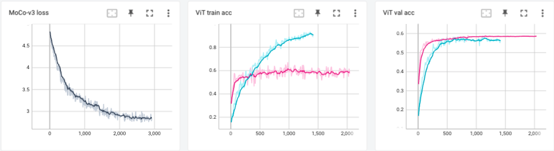

# MoCo-v3
This repo contains a re-implementation of MoCo-v3 in Pytorch Lightning.

## Recipe
We pre-train MoCo-v3, using a ViT-S encoder, on the unlabelled subset of STL-10. Then, to verify our implementation works, we finetune the ViT-S on the train subset of STL-10 and evaluate on the test set.

## Results
Below you can see the pre-training curve, as well as the finetuning curve:

 For reference, we also train ViT-S from scratch and see that the finetuned version:
- does not overfit
- reaches pick performance much faster

We additionally run k-NN evaluation, using k=10, and get the following results depending on our encoder parameters' initialization:
|       | Random | MoCo-v3 |
|-------|--------|---------|
| ViT-S | 31.78% | 53.62%  |

## Reproduction
- To pretrain your MoCo-v3 on STL10, run the script `pretrain.py`
- To train a ViT from scratch or finetune your MoCo-v3 checkpoint, run `finetune.py`.
 